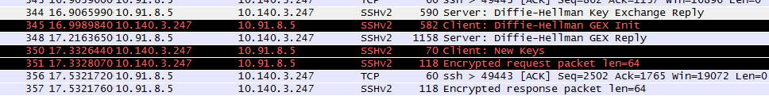

SSH小记
=======
#### 验证方式
SSH验证方式主要有以下两种:</br>
   1.基于口令的验证</br>
   2.基于密钥的验证

#### known_hosts文件

 当远程主机的公钥被接受以后，它就会被保存在文件<font color="HotPink">$HOME/.ssh/known_hosts</font>之中。下次再连接这台主机，系统就会认出它的公钥已经保存在本地了，从而跳过警告部分，直接提示输入密码。
 诺，就是类似下面这个警告就不得出现啦。。

 ```
 Are you sure you want to continue connecting (yes/no)? yes
 ```

#### authorized_keys文件

 简单的说，如果不想输入密码，那么可以采用<font color="HotPink">公钥登陆</font>.</br>
 所谓"公钥登录"，原理很简单，就是用户将自己的公钥储存在远程主机上。登录的时候，远程主机会向用户发送一段随机字符串，用户用自己的私钥加密后，再发回来。远程主机用事先储存的公钥进行解密，如果成功，就证明用户是可信的，直接允许登录shell，不再要求密码。</br>
 这种方法要求用户必须提供自己的公钥。如果没有现成的，可以直接用ssh-keygen生成一个,运行结束以后，在$HOME/.ssh/目录下，会新生成两个文件：<font color="HotPink">id_rsa.pub和id_rsa</font>。前者是你的公钥，后者是你的私钥。</br>

 这时再输入下面的命令，将公钥传送到远程主机host上面：
 ```
 $ ssh-copy-id user@host
 ```
 远程主机将用户的公钥，保存在登录后的用户主目录的<font color="HotPink">$HOME/.ssh/authorized_keys</font>文件中。公钥就是一段字符串，只要把它追加在authorized_keys文件的末尾就行了。

 注意哈，如果有问题，你需要检查远程主机的/etc/ssh/sshd_config这个文件，检查下面几行前面"#"注释是否取掉

 ```
 RSAAuthentication yes
 PubkeyAuthentication yes
 AuthorizedKeysFile .ssh/authorized_keys
 ```
#### Troubleshooting登陆
 当出现问题时，可以下面这个命令来帮助解决问题：
 ```
 $ssh -vvv user@host
 ```
#### 共同建立加密通道
那么在认证之前，双方如何建立起加密的通道呢？</br>
双方采用一种<font color="HotPink">Diffie-Hellman算法</font>共同为该会话建立密钥。每一方的一部分私有数据，加上来自对方的一部分公共数据，通过这种算法计算，能够得出完全相同的密钥用于本次会话。
如下的抓包可以看到：

生成的密钥是对称式密钥，一方用于加密信息的密钥等同于另一方用于解密信息的密钥，而任何第三方由于不持有该密钥，是无法解密双方传递的内容的。

会话加密通道建立后，SSH开始进入用户认证阶段。

#### 总结
共同建立加密通道->验证->通信</br>
对称加密被 SSH 用来加密整个连接。和很多人想的不一样，<font color="HotPink">非对称加密中的公/私钥匙对只是用来验证，而不是用来加密连接的</font>。对称加密甚至能够防止密码认证阶段的数据被偷窥。</br>
SSH 可以配置使用多种不同的对称加密算法，包括 AES, Blowfish, 3DES, CAST128, 和 Arcfour，双方会协商选择一种都支持的算法。

#### 补充：对称加密
这类算法在加密和解密时使用相同的密钥，或是使用两个可以简单地相互推算的密钥。
明文 <-> 密钥 <-> 密文
#### 补充：非对称加密
对称加密的缺点：比如你们1000个人之间都使用同一个密钥进行密文传输，只要其中一个人密钥被盗窃了，那么整体加密的信息将都被破解了。
非对称加密就是张三李四各自有自己的公钥私钥对。
这种加密算法应用非常广泛，SSH, HTTPS, TLS，电子证书，电子签名，电子身份证等等。
