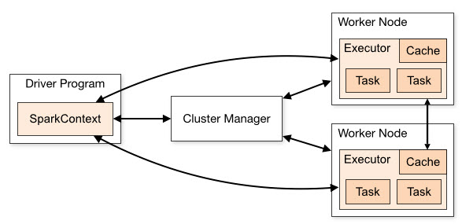
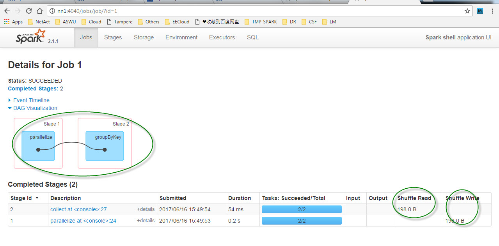

Spark基本概念
=======
#### Reference
<http://www.jianshu.com/p/e41b18a7e202>
<http://spark.apache.org/docs/latest/cluster-overview.html>
#### 概念解释
| 术语 | 解释描述 |
|:------- | :--- |
|Application|用户程序，由Driver Program和Executor组成|
|Application Jar|包含着用户Spark Application的jar包。</br>在有些例子中，客户可能会想创建一个“Uber Jar”，这个jar包是包含了Application和dependency的。</br>但是用户的Jar包是不能包含Hadoop和Spark的lib，这些lib在运行时将会在运行时自动加载|
|Driver program|运行main和创建SparkContext的进程|
|Cluster manager|用来获取集群中资源的外部service。比如（standalone manager，MESOS,YARN)|
|Deploy Mode|根据Driver的在哪里运行来区分。在“Cluster Mode”中，Driver是由framework来launch，运行在<font color="HotPink">集群中</font>的；在“Client Mode”，Driver是由submitter来launch的，并且运行在<font color="HotPink">集群外</font>。|
|Worker Node|在集群中，任何可以运行Application Code的节点|
|Executor|为一个Application启动的进程，运行在worker节点上； 是用来运行tasks以及保存数据到内存或者存储上。每一个Application都有自己的Executors。|
|Task|发送给一个Executor的工作单位|
|Job|一个并发的计算，由多个tasks组成；是为了响应Spark Action（比如save,collect)产生的。|
|Stage|每一个job都会分成多个Stage，每一个Stage会分成多个小组，每个小组有一系列的tasks组成。Stage之间是相互依赖的|

#### Spark集群
一组计算机的集合，每个计算机作为独立的计算资源，又可以虚拟出多个具备计算能力的虚拟机，这些虚拟机是集群中的计算单元。</br>
Spark的核心模块专注于调度和管理虚拟机之上的的分布式计算任务的执行。</br>
集群中的计算资源则交给Cluster Manager这个角色去管理。</br>
Cluster Manager Types:
1. Standalone: Spark自带的
2. Apache Mesos
3. Hadoop Yarn
#### Deploy模式
Spark有<font color="HotPink“>Client和Cluster</font>两种部署Application的模式。
1. Application以Client模式部署时，Driver是运行在Client节点。
2. Application以Cluster模式部署时，Driver运行在worker节点，和Executor一样由Cluster Manger启动。
#### SparkContext
Spark最重要的API，用户逻辑与Spark集群交互的接口，，它会和Cluster Master交互，包括申请计算资源。
#### Driver和Executor
1. Driver进程为主控进程，负责执行用户application里面的main方法,提交Job，并且把Job转化成Task，在各个executor进程之间协调Task的调度
2. 运行在worker上面的Executor负责执行Task，并将结果返回给Driver，同时为需要缓存的RDD提供存储功能。
#### Components组件

1. 每一个 spark application都有一组自己独立的executor processes，这些进程存在于application的整个生命周期，以多线程方式run tasks。</br>
这个有一个好处，就是把各个application隔离开来。不仅从schedule端（每个driver只schedule自己的tasks），而且从executor端也隔离开来了。（不同application的task都是在不同的jvm上面运行）.</br>
那就意味着，不同的application（sparkcontext instance）不能够共享数据，除非把数据写到外部存储。
2. Spark对下面的ClusterManger是不关心的，Spark只关心能够获取到Executor进程，以及彼此之间可以通信。
3. Driver Program在它的整个生命周期，都必须监听和接受来自Executor的连接请求。从根本上说，就是必须保证worker节点从网络上可访问Driver Program。
4. 因为Driver需要调度Cluster中的Task，那么Driver应该运行在离worker节点很近的地方，最好是同一个局域网。如果你需要远程的给Cluster发送请求，最好是给Driver开一个RPC，然后让Driver从近端提交操作，而不是让Driver离worker很远。
#### 什么是shuffle
这个按照一定的规则对数据重新分区的过程就是Shuffle（洗牌）。</br>
以Shuffle为边界，Spark将一个Job划分为不同的Stage，这些Stage构成了一个大粒度的DAG。Spark的Shuffle分为Write和Read两个阶段，分属于两个不同的Stage，前者是Parent Stage的最后一步，后者是Child Stage的第一步。比如我执行了如下操作：
```
scala> val kv1=sc.parallelize(List(("A",1),("B",2),("C",3),("A",4),("B",5)))
kv1: org.apache.spark.rdd.RDD[(String, Int)] = ParallelCollectionRDD[3] at parallelize at <console>:24
scala> kv1.groupByKey.collect
res2: Array[(String, Iterable[Int])] = Array((B,CompactBuffer(2, 5)), (A,CompactBuffer(1, 4)), (C,CompactBuffer(3)))
```
从监控页面 <http://nn1:4040/> 可以看到这个Job分成了两个Stage，，在第一个Stage中进行了Shuffle Write，在第二个Stage中进行了Shuffle Read。


关于shuffle的演进，参照下面这篇美文：</br>
<http://sharkdtu.com/posts/spark-shuffle.html>

关于shuffle的学习，参考[Shuffle学习](\2017-06-16-Spark-shuffle学习.md)
#### RDD（Resilient Distributed Dataset)
弹性分布式数据集,只读分区记录的集合，Spark对所处理数据的基本抽象。</br>
Spark中的计算可以简单抽象为RDD的创建，装换和返回操作结果的过程
#### Partition(分区)
一个RDD在物理上被切分为多个Partition，即数据分区，这些Partition可以分布在不同的节点上。Partition是Spark计算任务的基本处理单位，决定了并行计算的粒度，而Partition中的每一条Record为基本处理对象。例如对某个RDD进行map操作，在具体执行时是由多个并行的Task对各自分区的每一条记录进行map映射。
#### Job Scheduling
还没学习：<http://spark.apache.org/docs/latest/job-scheduling.html>
